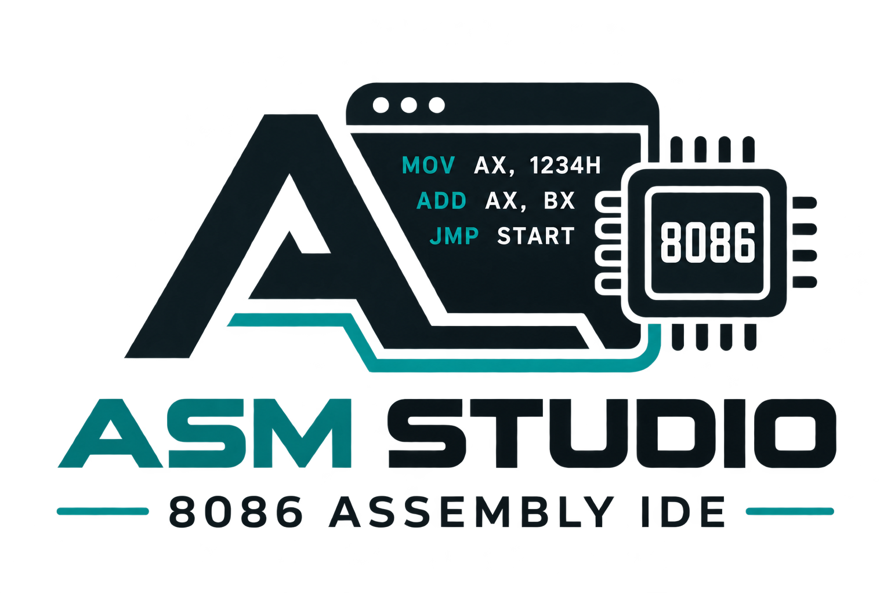

<div align="center">



# ASM Studio 2026 — Intel 8086 Assembly IDE & Teaching Suite

[](https://github.com/MMHT2000/ASM-Studio-2026/releases)
[](https://github.com/MMHT2000/ASM-Studio-2026/releases)
[-green?style=flat-square)](https://github.com/MMHT2000/ASM-Studio-2026)
[](https://buymeacoffee.com/MMHT2000)
[](./LICENSE)
[](https://github.com/MMHT2000/ASM-Studio-2026)

**A modern, lightning-fast, and pedagogical Intel 8086 Microprocessor IDE designed to replace legacy 16-bit DOS-box emulators for university students, educators, and systems engineers.**

[🐧 Ubuntu/Debian (.deb)](https://github.com/MMHT2000/ASM-Studio-2026/releases/download/v1.0.0/asm-studio-2026_1.0.0_amd64.deb) • [🐧 Linux Portable (.tar.gz)](https://github.com/MMHT2000/ASM-Studio-2026/releases/download/v1.0.0/ASM-Studio-2026-v1.0.0-Linux-x64.tar.gz) • [💻 Windows (.zip)](https://github.com/MMHT2000/ASM-Studio-2026/releases/download/v1.0.0/ASM-Studio-2026-v1.0.0-Windows-x64.zip) • [Installation Guide](#-installation--downloads) • [Features](#key-features)

</div>

---

## ⚡ Highlights at a Glance

* **16-bit Real Mode CPU Core**: High-fidelity cycle-accurate Intel 8086 execution with 14 general, segment, index, and pointer registers (`AX`, `BX`, `CX`, `DX`, `SI`, `DI`, `SP`, `BP`, `IP`, `CS`, `DS`, `SS`, `ES`) and 9 status flags (`CF`, `ZF`, `SF`, `OF`, `PF`, `AF`, `DF`, `IF`, `TF`).
* **Time-Travel Debugging**: Step backwards in execution history (<kbd>Shift + F10</kbd> / <kbd>F8</kbd>) with zero state corruption thanks to a deterministic 150-step snapshot stack.
* **Animated Step-by-Step Stepping**: Watch instructions execute live at controllable clock frequencies (1 Hz to 60 Hz) with register mutation glow highlights.
* **Interactive RAM Hex Editor**: Double-click any memory cell in real-time to alter memory bytes in-place. Quick jump to `.DATA`, `.CODE`, `STACK`, or `IVT` segments.
* **Virtual Hardware Peripherals**:
  * **8-Bit LED Bar** mapped to I/O Port `0378h`
  * **6-Light Traffic System** (North/South & East/West) mapped to I/O Port `0379h`
  * **4-Digit 7-Segment Display** with binary-coded decimal decoding mapped to I/O Port `0300h`
* **Multi-Provider AI Co-Pilot Tutor**: Connect **Google Gemini**, **OpenAI** (GPT-4o, GPT-5, GPT-6, o3-mini), or **Anthropic Claude** with open-ended model inputs, custom API Base URLs (OpenRouter, Ollama, LM Studio), and built-in offline diagnostic heuristics.
* **Monaco Code Editor**: Professional assembly editor featuring MASM/Emu8086 tokenization, opcode hover documentation, line glyph breakpoints, and lint diagnostics.
* **Appearance Customization**: 7 themes (Catppuccin Mocha, VS Code Dark+, One Dark Pro, Monokai, Dracula, GitHub Light, Custom), font families (JetBrains Mono, Fira Code), and custom color pickers.
* **Multi-Platform Native Applications**:
  * **Ubuntu / Debian**: Native `.deb` package with full desktop menu and icon integration.
  * **Universal Linux**: Zero-install portable `.tar.gz` with launcher and optional user desktop installer (`install.sh`).
  * **Windows 10 / 11**: 100% self-contained standalone `.exe` powered by .NET 10 & Microsoft WebView2 with dark titlebar.

---

## 📦 Installation & Downloads

Official pre-built releases are published on the **[GitHub Releases Page](https://github.com/MMHT2000/ASM-Studio-2026/releases)**.

### 🐧 Ubuntu & Debian Systems (`.deb`)
Recommended for Ubuntu 20.04, 22.04, 24.04, Debian 11/12, and Linux Mint:
```bash
# 1. Download the latest .deb package
wget https://github.com/MMHT2000/ASM-Studio-2026/releases/download/v1.0.0/asm-studio-2026_1.0.0_amd64.deb

# 2. Install using apt (resolves system dependencies automatically)
sudo apt update
sudo apt install ./asm-studio-2026_1.0.0_amd64.deb

# 3. Launch from Ubuntu application launcher or terminal
asm-studio
```

### 🐧 Portable Linux Tarball (`.tar.gz`)
Works on **any** 64-bit Linux distribution (Fedora, Arch, openSUSE, Manjaro) without requiring root/sudo privileges:
```bash
# 1. Download and extract
wget https://github.com/MMHT2000/ASM-Studio-2026/releases/download/v1.0.0/ASM-Studio-2026-v1.0.0-Linux-x64.tar.gz
tar -xzf ASM-Studio-2026-v1.0.0-Linux-x64.tar.gz
cd ASM-Studio-2026-v1.0.0-Linux-x64

# 2. Run directly
./asm-studio

# 3. (Optional) Register in your desktop application menu:
chmod +x install.sh
./install.sh
```

### 💻 Windows 10 & 11 (`.zip`)
1. Download **[ASM-Studio-2026-v1.0.0-Windows-x64.zip](https://github.com/MMHT2000/ASM-Studio-2026/releases/download/v1.0.0/ASM-Studio-2026-v1.0.0-Windows-x64.zip)**.
2. Extract the archive anywhere on your disk.
3. Double-click `ASMStudio.exe` to run immediately (offline, zero dependencies).

---

## 📸 Core Features

### 1. Intel 8086 Microprocessor Core
- Full two-pass assembler supporting `.model`, `.stack`, `.data`, `.code`, `proc`/`endp`, `DB`, `DW`, and `DUP(?)`.
- Handles data transfer, ALU arithmetic (`ADD`, `ADC`, `SUB`, `SBB`, `MUL`, `IMUL`, `DIV`, `IDIV`, `NEG`, `DAA`, `AAA`), bitwise logic (`AND`, `OR`, `XOR`, `NOT`, `TEST`, shifts/rotates), and subroutines (`CALL`, `RET`, `PUSH`, `POP`).
- Supports DOS Services via `INT 21h`:
  - `AH = 01h`: Read single character from console
  - `AH = 02h`: Print single character to console
  - `AH = 09h`: Print string terminated by `$`
  - `AH = 4Ch`: Clean exit to DOS with return code

### 2. Time-Travel Debugger & Stepping
- **Step Forward (<kbd>F10</kbd>)**: Execute exactly one instruction at the current `IP` pointer.
- **Step Back (<kbd>Shift + F10</kbd> / <kbd>F8</kbd>)**: Revert instruction by instruction, restoring register and memory state effortlessly.
- **Animate / Pause (<kbd>F6</kbd>)**: Continuous stepping at adjustable frequencies: 1 Hz (1s), 2.5 Hz, 5 Hz, 10 Hz, 25 Hz, or 60 Hz.
- **Fast Run (<kbd>F7</kbd>)**: Execute until next breakpoint or `HLT` / `INT 21h AH=4Ch`.

### 3. Interactive Memory Hex Editor
- View and edit all 64 KB of memory (`0000h`–`FFFFh`).
- Preset jump buttons:
  - `.DATA`: Segment address where variables reside
  - `.CODE`: Code execution start address (`CS:IP`)
  - `STACK`: Bottom of stack memory (`SS:SP`)
  - `IVT`: Interrupt Vector Table (`0000h:0000h`)
- Inline byte editor: Double-click any byte to change its hex value live while paused or running.
- Detailed inspector displays selected byte in Hex, Dec, Binary, ASCII, 16-bit Little-Endian Word, and Symbol name.

### 4. Virtual Peripherals Simulation
- **8-Bit LED Bar (Port 0378h)**: Live animated LEDs reflecting bit patterns written via `OUT 0378h, AL`.
- **Dual Traffic Light Controller (Port 0379h)**: Simulates an intersection with Red, Yellow, and Green lights for North/South and East/West directions.
- **4-Digit 7-Segment Display (Port 0300h)**: Hardware multiplexer decoding binary numbers and BCD into 7-segment illuminated displays.

### 5. Multi-Provider AI Co-Pilot Tutor
- Switch between **Google Gemini**, **OpenAI**, and **Anthropic Claude**.
- Future-proof open model input: specify `gpt-5`, `gpt-5.5`, `gpt-6`, `claude-4`, `gemini-4.0`, or pick quick presets.
- Custom API Base URL: seamlessly connect to **OpenRouter** (`https://openrouter.ai/api/v1`), **Local Ollama** (`http://localhost:11434/v1`), or private proxy gateways.
- 1-Click quick prompts:
  - 🔍 *Explain My Code*
  - ⚠️ *Why Did It Crash?*
  - ⚡ *Optimize Code*
  - 🚩 *Explain Flags*
- Local offline diagnostic heuristics detect uninitialized `DS`, missing `$` string terminators, and stack imbalances with zero API key required.

---

## ⌨️ Keyboard Shortcuts

| Shortcut | Action |
|:---|:---|
| <kbd>F5</kbd> | Assemble & Load Program into Memory |
| <kbd>F6</kbd> | Toggle Animated Stepping / Pause |
| <kbd>F7</kbd> | Fast Run to Breakpoint or Halt |
| <kbd>F10</kbd> | Step One Instruction Forward |
| <kbd>Shift + F10</kbd> / <kbd>F8</kbd> | Step Back (Time-Travel Undo Instruction) |
| <kbd>Ctrl + O</kbd> | Open `.asm` Source File from Disk |
| <kbd>Ctrl + S</kbd> | Save `.asm` Source File to Disk |
| <kbd>Ctrl + ,</kbd> | Open Settings & Preferences Dialog |
| **Click Gutter** | Toggle Breakpoint on Code Line |
| **Double-Click RAM** | In-Place Memory Byte Editing |

---

## 📦 Download & Installation

### Option 1: Standalone Windows Executable (.exe)
1. Head over to the [Releases](https://github.com/MMHT2000/ASM-Studio-2026/releases) page.
2. Download the latest `ASM-Studio-2026-v1.0.0-Windows-x64.zip`.
3. Extract the zip archive anywhere on your machine.
4. Launch `ASMStudio.exe`.
   - *No installation, no registry changes, zero background services. Runs 100% offline.*

### Option 2: Running in Web Browser
```bash
# Clone the repository
git clone https://github.com/MMHT2000/ASM-Studio-2026.git
cd ASM-Studio-2026/asm-studio

# Install dependencies
npm install

# Start local development server
npm run dev
```
Open [http://localhost:5173](http://localhost:5173) in your browser.

---

## 🧪 Testing & Verification

ASM Studio includes an automated end-to-end test suite (`src/test/e2e.test.ts`) covering 28 test suites:

```bash
cd asm-studio
npm test
```

```text
======================================================
   ASM STUDIO 2026 - END-TO-END VERIFICATION SUITE
======================================================
[1/8] Testing Assembler & Directives...
  ✓ Assembler handles .model, .stack, .data, .code, and DB/DW
  ✓ Assembler correctly catches syntax and operand errors
[2/8] Testing CPU Arithmetic & Logic ALU...
  ✓ ADD, ADC, SUB, SBB, NEG and Flag computations
  ✓ INC does NOT modify Carry Flag (Intel 8086 specification)
  ✓ Multiplication (MUL, IMUL) & Division (DIV, IDIV)
  ✓ Logical Bitwise (AND, OR, XOR, NOT, TEST, Shifts)
[3/8] Testing Jumps, Branches, Loops, CALL/RET...
  ✓ Conditional Jumps & LOOP instruction
  ✓ Stack LIFO (PUSH, POP) and Subroutines (CALL, RET)
[4/8] Testing Memory Addressing Modes...
  ✓ Direct, Register Indirect [BX], Based Indexed [BX+SI], Displacement
[5/8] Testing Virtual Hardware Devices & INT 21h...
  ✓ Virtual Hardware Ports (0378h LED, 0379h Traffic Light, 0300h 7-Segment)
  ✓ DOS INT 21h Services (AH=01h read, AH=02h char, AH=09h string, AH=4Ch exit)
[6/8] Testing All 8 Curated Sample Programs...
  ✓ Sample Program: "Hello, World & Basic Loop" (hello-world)
  ✓ Sample Program: "String Reversal (Stack Demo)" (reverse-string)
  ✓ Sample Program: "Bubble Sort (Array Sorting)" (bubble-sort)
  ✓ Sample Program: "Simple Calculator (+, -, *, /)" (simple-calculator)
  ✓ Sample Program: "BCD & Decimal Arithmetic (DAA / AAA)" (bcd-math)
  ✓ Sample Program: "Traffic Lights (Port 0379h)" (traffic-lights)
  ✓ Sample Program: "8-Bit LED Binary Counter (Port 0378h)" (led-counter)
  ✓ Sample Program: "4-Digit 7-Segment Display (Port 0300h)" (seven-segment-counter)
[7/8] Testing Time-Travel Debugging & Memory Editing...
  ✓ Time-Travel Snapshot & Restore Determinism
  ✓ Direct Memory Editing via setMemoryByte
[8/8] Testing File Utilities & Gemini Offline Diagnostics...
  ✓ URL Hash Encoding/Decoding round-trip with Unicode and Special Chars
  ✓ Assembler Listing (.lst) and Binary (.com) generation
  ✓ Gemini AI Tutor Offline Diagnostic Heuristics
[9/9] Testing Multi-Provider AI & Theme/Font Customization...
  ✓ Theme Presets, Color Luminance and Font Families definitions
  ✓ Settings Store manages Theme, Custom Colors, Fonts and AI Providers
  ✓ askAi correctly delegates based on active AI provider with offline fallback
  ✓ Future-proof arbitrary model IDs (GPT-6, GPT-5.5, Claude 4, Gemini 4) and custom base URLs
======================================================
🎉 ALL 28 CHECKS PASSED PERFECTLY! (100% SUCCESS)
======================================================
```

---

## 🛠️ Building from Source

### Requirements
- **Node.js**: v18+ (tested on Node v20 and v26)
- **.NET SDK**: 10.0+ (for building the Windows executable)

### 1. Build the Web App
```bash
cd asm-studio
npm install
npm run build
```

### 2. Build the Windows Desktop Executable
```bash
cd ../ASMStudio-App
dotnet publish -c Release -r win-x64 --self-contained true -p:PublishSingleFile=true -p:IncludeNativeLibrariesForSelfExtract=true -o ../release-selfcontained
```
The compiled executable will be located at `release-selfcontained/ASMStudio.exe`.

---

## ☕ Support the Project

If **ASM Studio 2026** helps your studies, university coursework, or 8086 assembly research, consider supporting continued development:

[](https://buymeacoffee.com/MMHT2000)

Your support helps keep ASM Studio 2026 open-source, maintained, and continuously updated with new features and hardware modules!

---

## 📄 License

This project is licensed under the MIT License — see the [LICENSE](./LICENSE) file for details.

Developed with ❤️ by **MMHT2000** for computer science students and vintage computing enthusiasts.
